# 2019 Naeem-Esf, Pro, food

## Experiment Metadata

```yaml
main_stressor: Esfenvalerate
max_survival: 1
organism: Daphnia magna
pub: "Environmental Stress Increases Synergistic E\uFB00ects of Pesticide Mixtures\
  \ on Daphnia, 10.1021/acs.est.9b04293"

```


## 2019 Naeem-Esf, Pro, food_7_days

### Data Table

|    |   Concentration |   Control Survival Rate |   Prochloraz 1 |   Prochloraz 32 |   Prochloraz 100 |   Food 1% |   Food 1% + Prochloraz 1 |   Food 1% + Prochloraz 32 |   Food 1% + Prochloraz 100 |
|---:|----------------:|------------------------:|---------------:|----------------:|-----------------:|----------:|-------------------------:|--------------------------:|---------------------------:|
|  0 |          0      |                1        |       1        |       0.933333  |        0.977778  | 0.866667  |                0.666667  |                  0.633333 |                  0.511111  |
|  1 |          0.0001 |                1        |       1        |       0.931818  |        0.967     | 0.8       |                0.733333  |                  0.566667 |                  0.266667  |
|  2 |          0.001  |                0.966667 |       1        |       0.911111  |        0.966667  | 0.7       |                0.6       |                  0.466667 |                  0.166667  |
|  3 |          0.01   |                0.9      |       0.93     |       0.888889  |        0.83      | 0.6       |                0.4       |                  0.333333 |                  0.0666667 |
|  4 |          0.1    |                0.844444 |       0.888889 |       0.777778  |        0.755556  | 0.533333  |                0.377778  |                  0.2      |                  0.0888889 |
|  5 |          0.316  |                0.622222 |       0.711111 |       0.4       |        0.4       | 0.222222  |                0.0888889 |                  0        |                  0         |
|  6 |          1      |                0.333333 |       0.355556 |       0.0222222 |        0.0888889 | 0.0222222 |                0.0222222 |                  0        |                  0         |
|  7 |          3.16   |                0        |       0        |       0         |        0         | 0         |                0         |                  0        |                  0         |

Specific Settings:

```yaml
days: '7.0'
```


### Prochloraz 1 - SAM Prediction

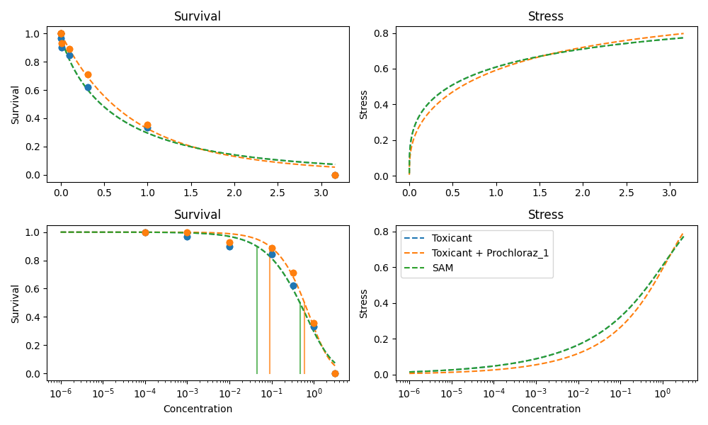
### Prochloraz 32 - SAM Prediction

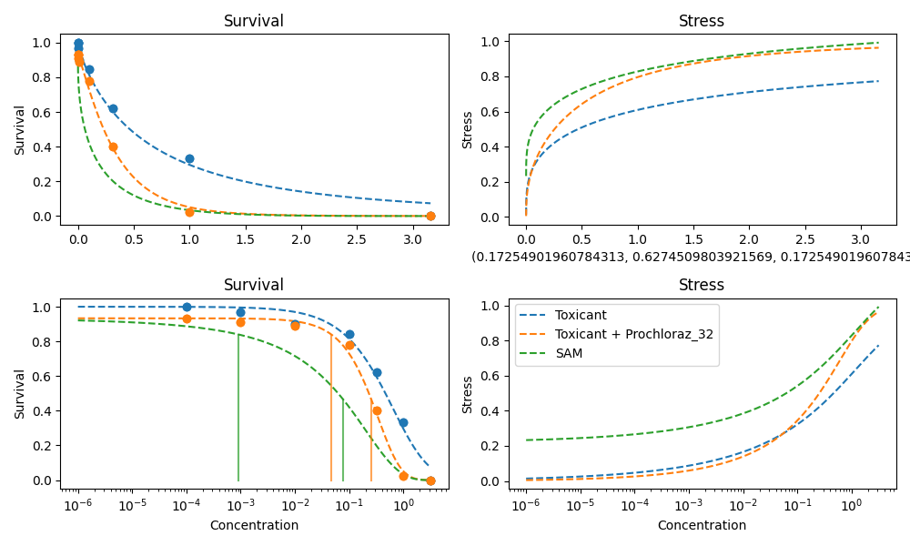
### Prochloraz 100 - SAM Prediction

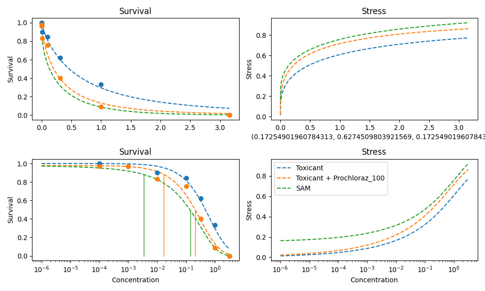
### Food 1% - SAM Prediction

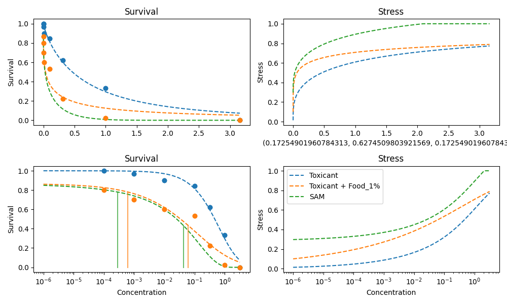
### Food 1% + Prochloraz 1 - SAM Prediction

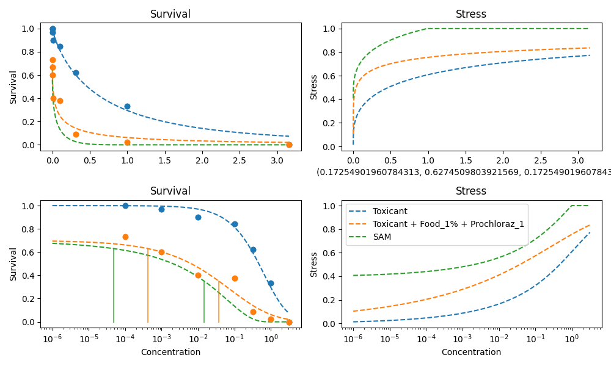
### Food 1% + Prochloraz 32 - SAM Prediction

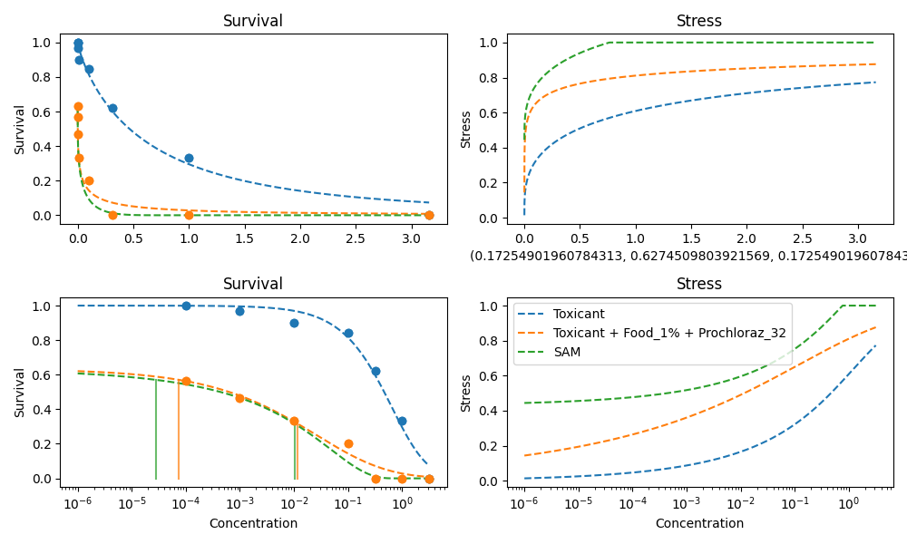
### Food 1% + Prochloraz 100 - SAM Prediction

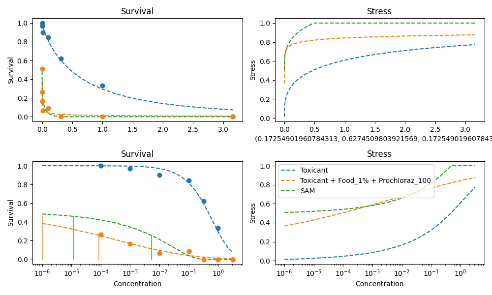


## 2019 Naeem-Esf, Pro, food_21_days

### Data Table

|    |   Concentration |   Control Survival Rate |   Prochloraz 1 |   Prochloraz 32 |   Prochloraz 100 |   Food 1% |   Food 1% + Prochloraz 1 |   Food 1% + Prochloraz 32 |   Food 1% + Prochloraz 100 |
|---:|----------------:|------------------------:|---------------:|----------------:|-----------------:|----------:|-------------------------:|--------------------------:|---------------------------:|
|  0 |          0      |                0.933333 |       0.933333 |        0.888889 |        0.888889  |  0.844444 |                0.555556  |                  0.533333 |                  0.488889  |
|  1 |          0.0001 |                0.933333 |       0.933333 |        0.8      |        0.85      |  0.733333 |                0.6       |                  0.4      |                  0.2       |
|  2 |          0.001  |                0.833333 |       0.933333 |        0.844444 |        0.8       |  0.666667 |                0.5       |                  0.266667 |                  0.166667  |
|  3 |          0.01   |                0.8111   |       0.9      |        0.833333 |        0.71      |  0.533333 |                0.333333  |                  0.233333 |                  0         |
|  4 |          0.1    |                0.8      |       0.8      |        0.666667 |        0.622222  |  0.466667 |                0.311111  |                  0.166667 |                  0.0666667 |
|  5 |          0.316  |                0.555556 |       0.644444 |        0.288889 |        0.355556  |  0.2      |                0.0888889 |                  0        |                  0         |
|  6 |          1      |                0.311111 |       0.311111 |        0        |        0.0666667 |  0        |                0         |                  0        |                  0         |
|  7 |          3.16   |                0        |       0        |        0        |        0         |  0        |                0         |                  0        |                  0         |

Specific Settings:

```yaml
days: '21.0'
```


### Prochloraz 1 - SAM Prediction

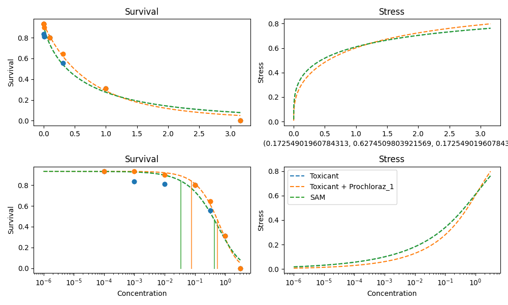
### Prochloraz 32 - SAM Prediction


### Prochloraz 100 - SAM Prediction

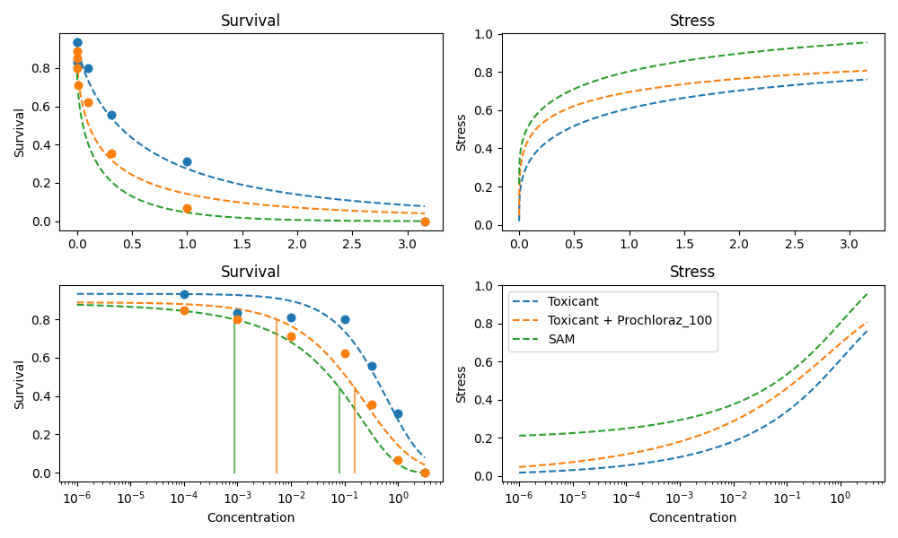
### Food 1% - SAM Prediction

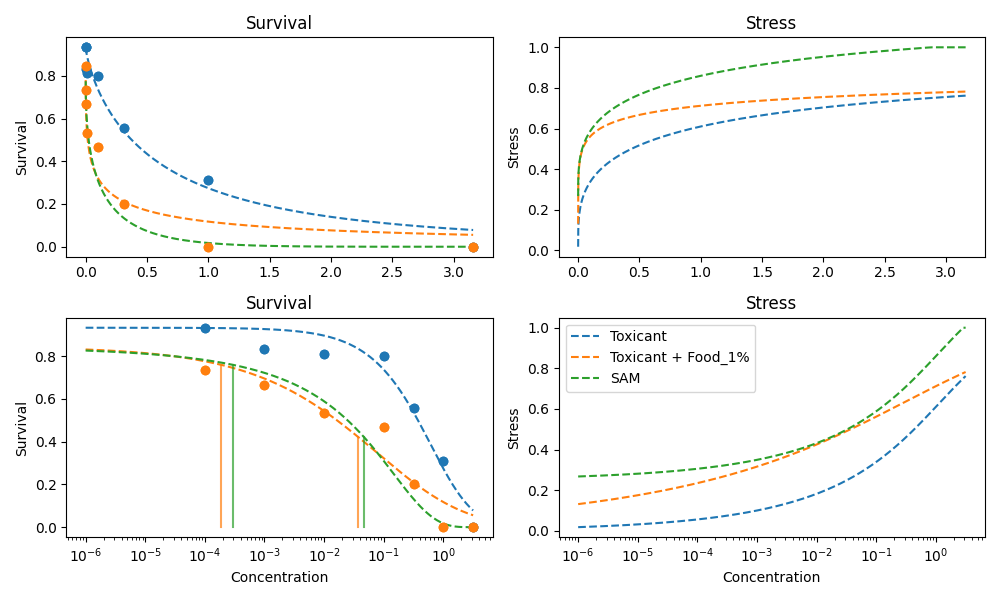
### Food 1% + Prochloraz 1 - SAM Prediction

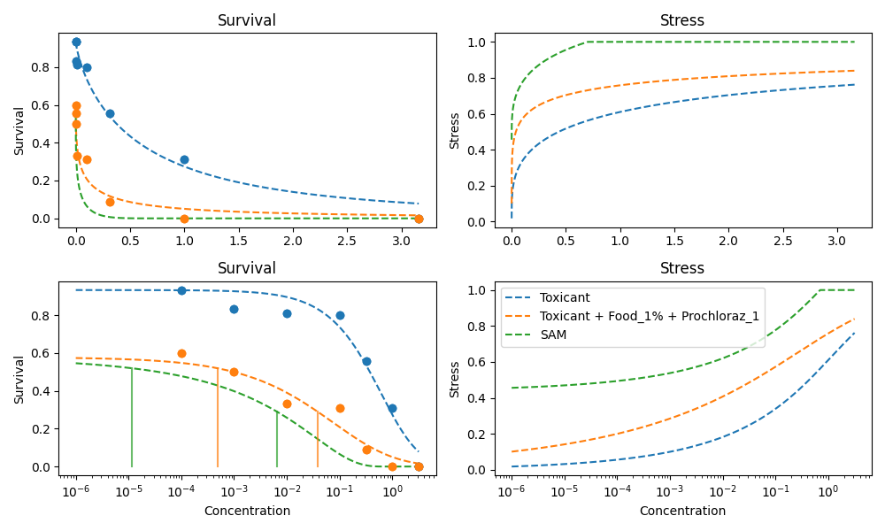
### Food 1% + Prochloraz 32 - SAM Prediction

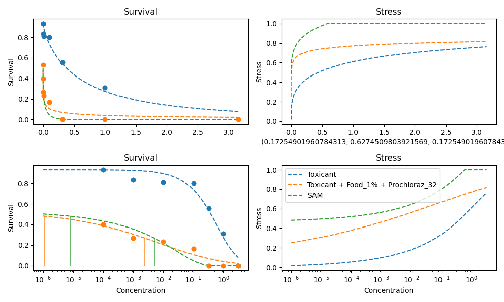
### Food 1% + Prochloraz 100 - SAM Prediction

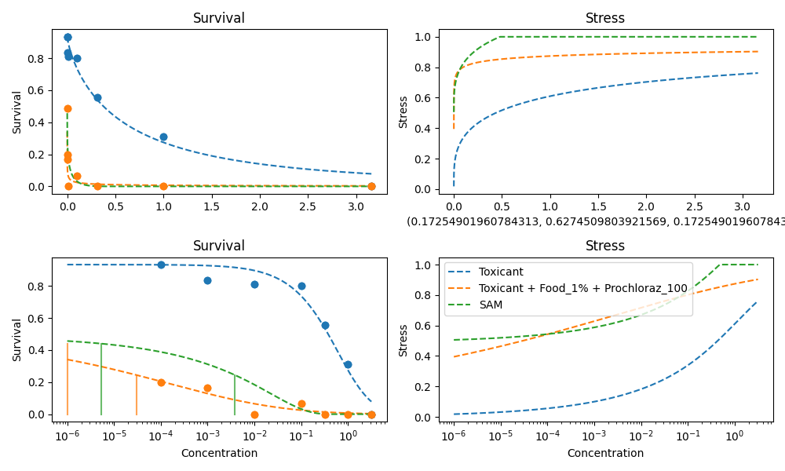
