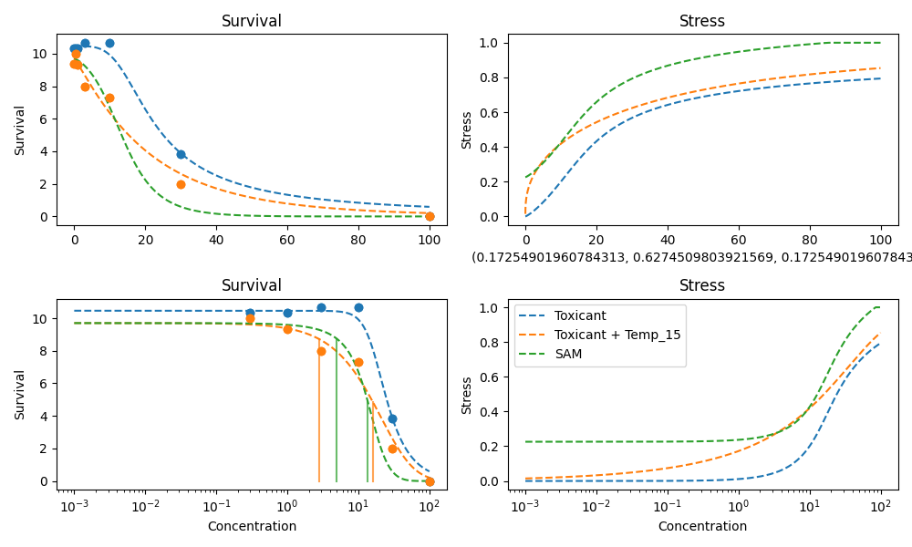

# 2023 Huang Neon_Flupyradifurone

## Experiment Metadata

```yaml
days: 28
main_stressor: Flupyradifurone
max_survival: 11
organism: Gammarus pulex

```


## 2023 Huang Neon_Flupyradifurone

### Data Table

|    |   Concentration |   Control Survival Rate |   Temp 15 |
|---:|----------------:|------------------------:|----------:|
|  0 |             0   |                   10.3  |      9.4  |
|  1 |             0.3 |                   10.33 |     10    |
|  2 |             1   |                   10.33 |      9.33 |
|  3 |             3   |                   10.67 |      8    |
|  4 |            10   |                   10.67 |      7.33 |
|  5 |            30   |                    3.83 |      2    |
|  6 |           100   |                    0    |      0    |

### Temp 15 - SAM Prediction


