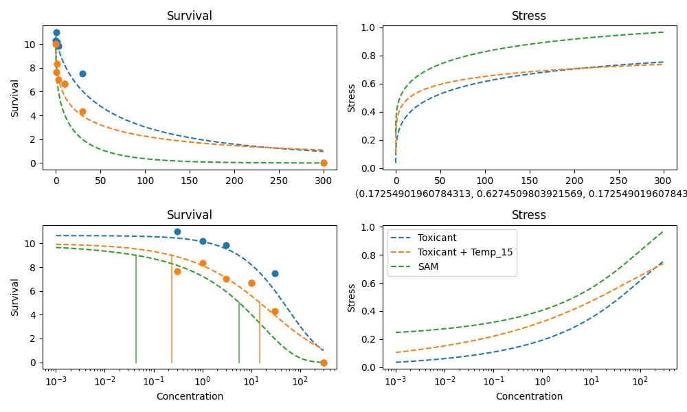

# 2023 Huang Neon_Imidachloprid

## Experiment Metadata

```yaml
chemical: Imidachloprid
days: 28
max_survival: 11
organism: Gammarus pulex

```


## 2023 Huang Neon_Imidachloprid

### Data Table

|    |   Concentration |   Control Survival Rate |   Temp 15 |
|---:|----------------:|------------------------:|----------:|
|  0 |             0   |                   10.3  |     10    |
|  1 |             0.3 |                   11    |      7.67 |
|  2 |             1   |                   10.17 |      8.33 |
|  3 |             3   |                    9.83 |      7    |
|  4 |            10   |                    6.67 |      6.67 |
|  5 |            30   |                    7.5  |      4.33 |
|  6 |           300   |                    0    |      0    |

Specific Settings:

```yaml
hormesis_concentration: '0.3'
```


### Temp 15 - SAM Prediction


