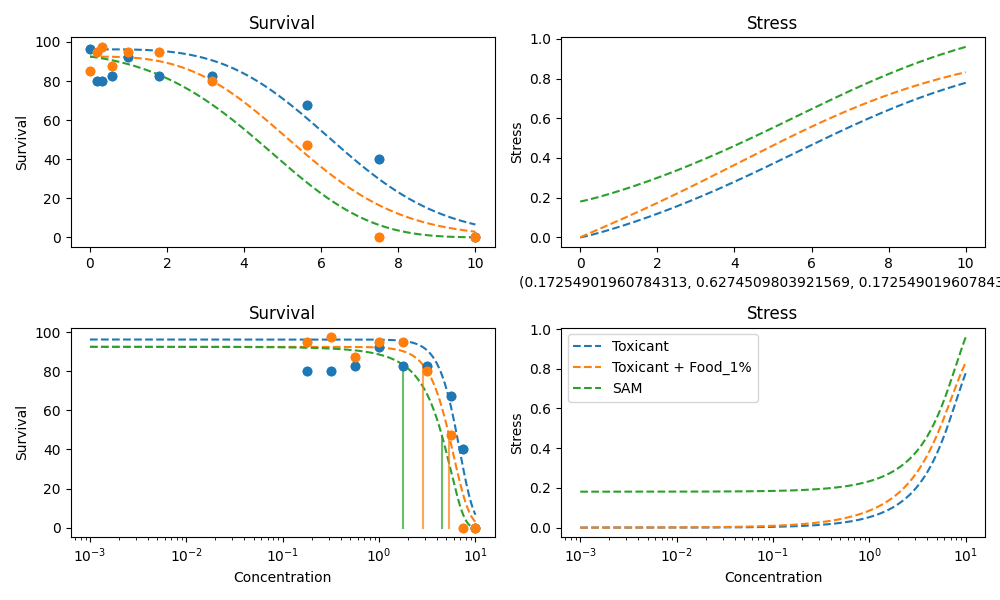

# 2024 Imrana-salt, food

## Experiment Metadata

```yaml
days: 21
main_stressor: Salt (NaCl)
max_survival: 100
organism: Daphnia magna

```


## 2024 Imrana-salt, food

### Data Table

|    |   Concentration |   Control Survival Rate |   Food 1% |
|---:|----------------:|------------------------:|----------:|
|  0 |           0     |                   96.25 |      85   |
|  1 |           0.178 |                   80    |      95   |
|  2 |           0.316 |                   80    |      97.5 |
|  3 |           0.562 |                   82.5  |      87.5 |
|  4 |           1     |                   92.5  |      95   |
|  5 |           1.78  |                   82.5  |      95   |
|  6 |           3.16  |                   82.5  |      80   |
|  7 |           5.62  |                   67.5  |      47.5 |
|  8 |           7.5   |                   40    |       0   |
|  9 |          10     |                    0    |       0   |

Specific Settings:

```yaml
hormesis_concentration: '1.0'
```


### Food 1% - SAM Prediction


