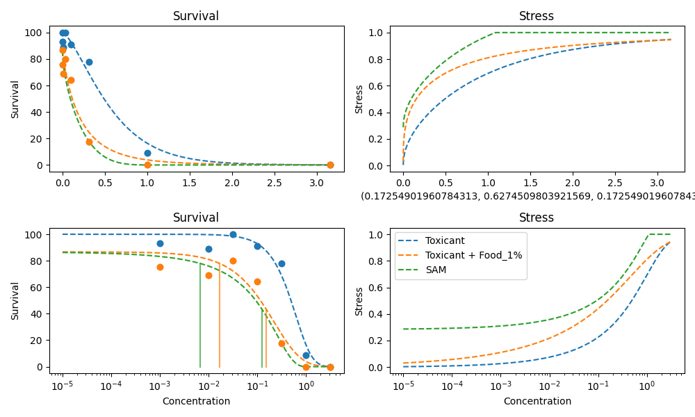
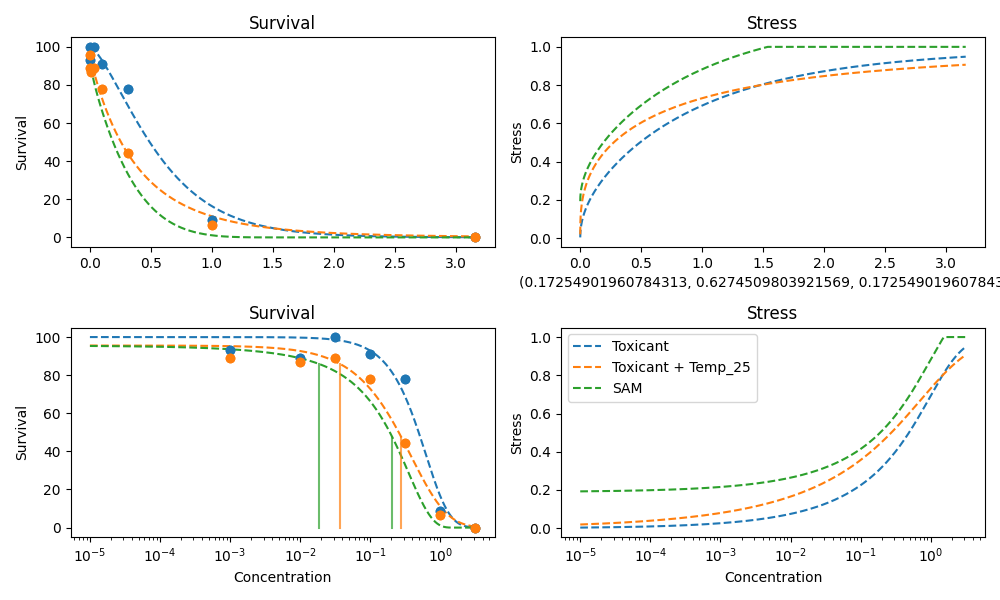
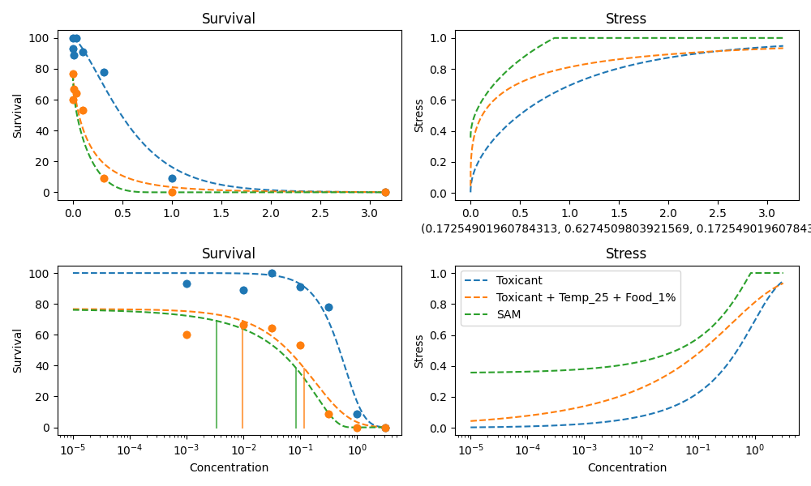
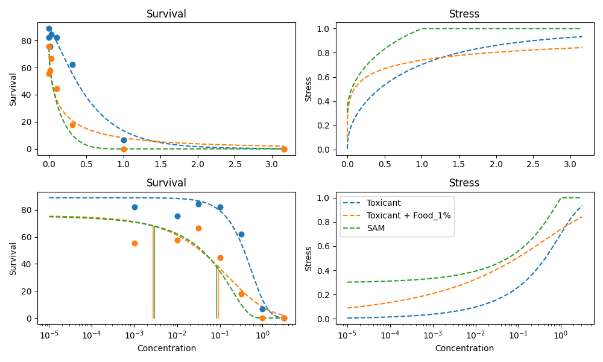
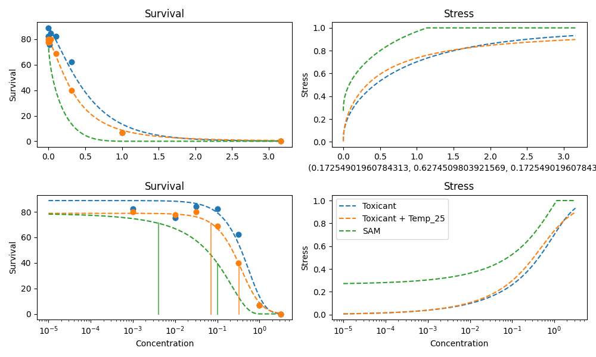
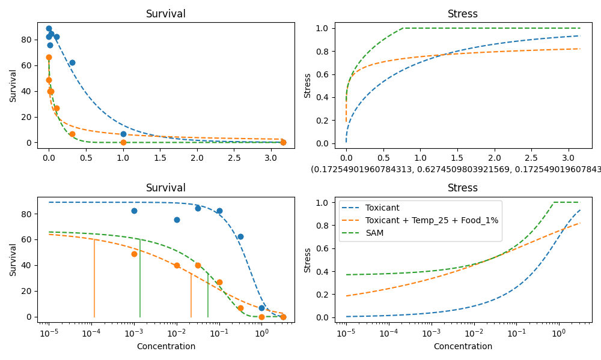
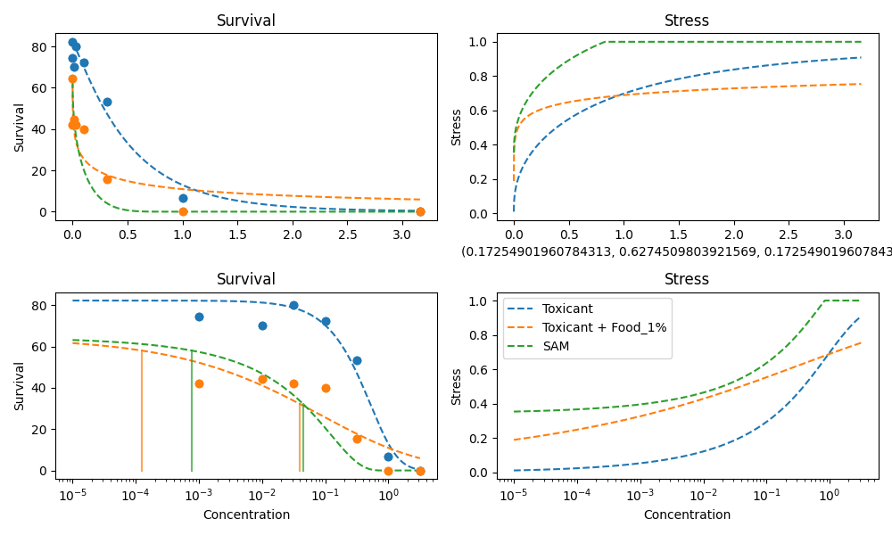
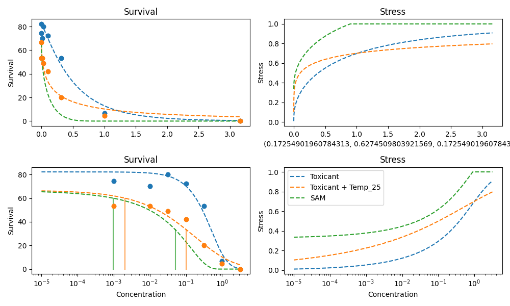
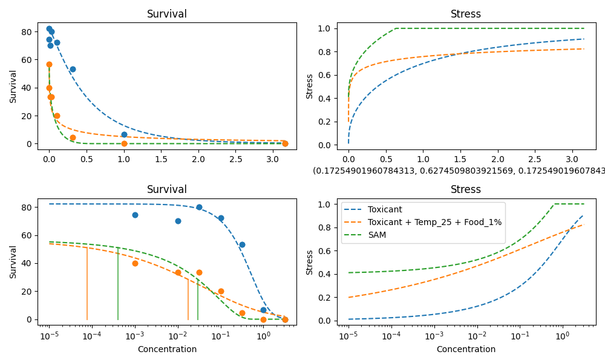

# 2024 Naeem-Mix13,°C,food

## Experiment Metadata

```yaml
chemical: Mix13
max_survival: 100
organism: Unknown

```


## 2024 Naeem-Mix13,°C,food_7_days

### Data Table

|    |   Concentration |   Control Survival Rate |   Food 1% |   Temp 25 |   Temp 25 + Food 1% |
|---:|----------------:|------------------------:|----------:|----------:|--------------------:|
|  0 |          0      |               100       |   86.66   |  95.5533  |            76.665   |
|  1 |          0.001  |                93.33    |   75.5533 |  88.8867  |            59.9967  |
|  2 |          0.01   |                88.8867  |   68.8867 |  86.66    |            66.6633  |
|  3 |          0.0316 |               100       |   79.9967 |  88.8833  |            64.4433  |
|  4 |          0.1    |                91.1067  |   64.44   |  77.7767  |            53.33    |
|  5 |          0.316  |                77.7767  |   17.7767 |  44.44    |             8.88667 |
|  6 |          1      |                 8.88333 |    0      |   6.66333 |             0       |
|  7 |          3.16   |                 0       |    0      |   0       |             0       |

Specific Settings:

```yaml
days: '7.0'
```


### Food 1% - SAM Prediction


### Temp 25 - SAM Prediction


### Temp 25 + Food 1% - SAM Prediction




## 2024 Naeem-Mix13,°C,food_14_days

### Data Table

|    |   Concentration |   Control Survival Rate |   Food 1% |   Temp 25 |   Temp 25 + Food 1% |
|---:|----------------:|------------------------:|----------:|----------:|--------------------:|
|  0 |          0      |                88.8867  |   75.5533 |  77.7733  |            66.66    |
|  1 |          0.001  |                82.2167  |   55.5533 |  79.9967  |            48.8867  |
|  2 |          0.01   |                75.55    |   57.7767 |  77.7733  |            39.9967  |
|  3 |          0.0316 |                84.44    |   66.6667 |  79.9967  |            40       |
|  4 |          0.1    |                82.22    |   44.44   |  68.8833  |            26.6633  |
|  5 |          0.316  |                62.22    |   17.7767 |  40       |             6.66667 |
|  6 |          1      |                 6.66333 |    0      |   6.66333 |             0       |
|  7 |          3.16   |                 0       |    0      |   0       |             0       |

Specific Settings:

```yaml
days: '14.0'
```


### Food 1% - SAM Prediction


### Temp 25 - SAM Prediction


### Temp 25 + Food 1% - SAM Prediction




## 2024 Naeem-Mix13,°C,food_21_days

### Data Table

|    |   Concentration |   Control Survival Rate |   Food 1% |   Temp 25 |   Temp 25 + Food 1% |
|---:|----------------:|------------------------:|----------:|----------:|--------------------:|
|  0 |          0      |                82.22    |   64.44   |  66.6633  |            56.665   |
|  1 |          0.001  |                74.44    |   42.22   |  53.33    |            39.9967  |
|  2 |          0.01   |                69.9967  |   44.4433 |  53.3333  |            33.33    |
|  3 |          0.0316 |                79.9967  |   42.22   |  48.8833  |            33.33    |
|  4 |          0.1    |                72.2167  |   39.9967 |  42.22    |            19.9933  |
|  5 |          0.316  |                53.3267  |   15.5533 |  19.9967  |             4.44333 |
|  6 |          1      |                 6.66333 |    0      |   4.44333 |             0       |
|  7 |          3.16   |                 0       |    0      |   0       |             0       |

Specific Settings:

```yaml
days: '21.0'
```


### Food 1% - SAM Prediction


### Temp 25 - SAM Prediction


### Temp 25 + Food 1% - SAM Prediction


